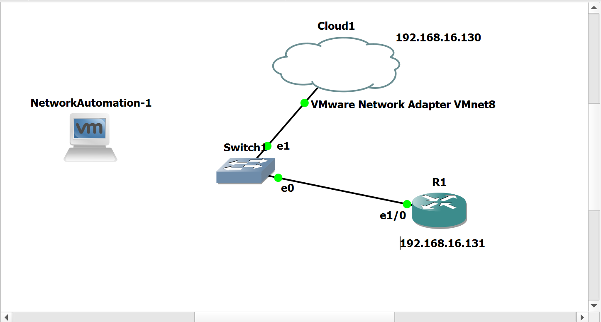
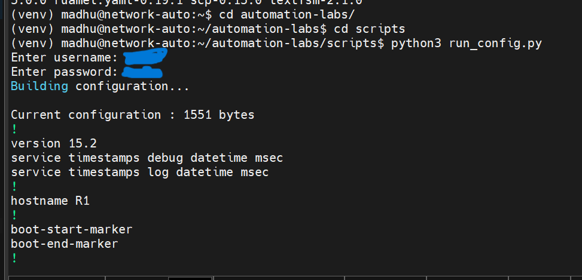
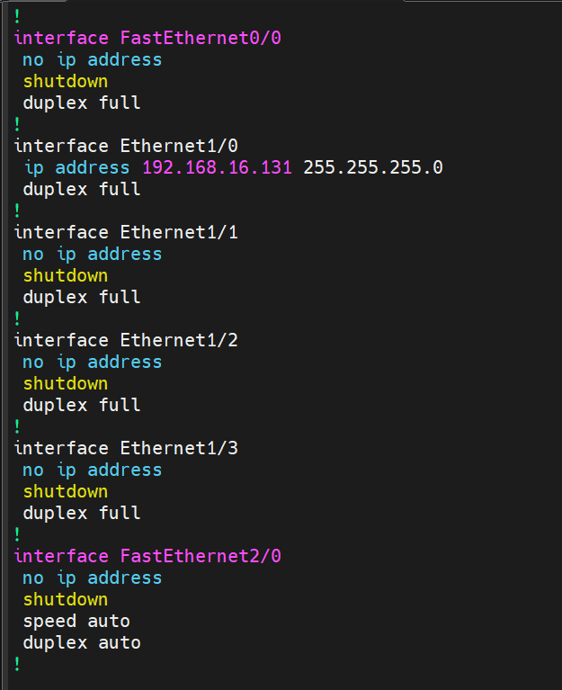

# Network Automation Lab 🚀

## 📌 Overview

This repository contains my hands-on practice in Network Automation using Python and Netmiko. As part of my learning journey, I built a lab environment using Ubuntu Server, VMware, and GNS3 VM to simulate real network scenarios.

I used Visual Studio Code for development, MobaXterm for remote connectivity, and GitHub for version control. Within this setup, I developed automation scripts to connect to Cisco devices via SSH, execute commands, and retrieve outputs programmatically.

This project reflects my effort to bridge networking concepts with automation using Python.

---

## 👨‍💻 About Me

I am learning Network Automation using Python and building projects to improve my skills. With a CCNA background, I aim to grow into a network automation role.

---

Project Objective

The goal of this repository is to:

* Learn network automation using Python
* Automate interaction with Cisco routers and switches
* Understand how SSH-based automation works
* Build a strong foundation for real-world automation roles

---

What I Have Done

* Created Python scripts using Netmiko
* Automated execution of commands like:

  * `show run`
  * `show ip interface brief`
* Established SSH connections to network devices
* Implemented secure input-based credential handling
* Used Git for version control and project tracking

---

📂 Scripts Included

### 🔹 run_config.py

Connects to a device and retrieves the full running configuration.

### 🔹 show_ip.py

Fetches interface details using `show ip interface brief`.

---
## 📊 Lab Topologies

### 🔹 Overall Lab Setup
The lab topology consists of a Cisco router (R1) with IP address `192.168.16.131`, an Ubuntu server with IP `192.168.16.130`, and a switch connecting the devices to the cloud network. This setup is used to perform SSH-based network automation using Python and Netmiko.

### 🔹 Run Config Lab
This lab demonstrates retrieving the running configuration from a Cisco device using automation.

---

### 🔹 Run Config Output
Output of the automated `show run` command.

---

### 🔹 Show IP Interface Output
Output of `show ip interface brief`.

---

🔐 Security Note

* No credentials are stored in the code
* Username and password are taken as input during runtime
* All IP addresses belong to a local lab environment

---

🔮 Future Improvements

* Automate multiple devices at once
* Add configuration push scripts
* Use environment variables for secure credential management
* Implement logging and error handling
* Expand to advanced network automation use cases

---

💡 Learning Outcome

This project helps me understand how networking and Python come together to automate tasks, improve efficiency, and reduce manual effort in real-world environments.

---
